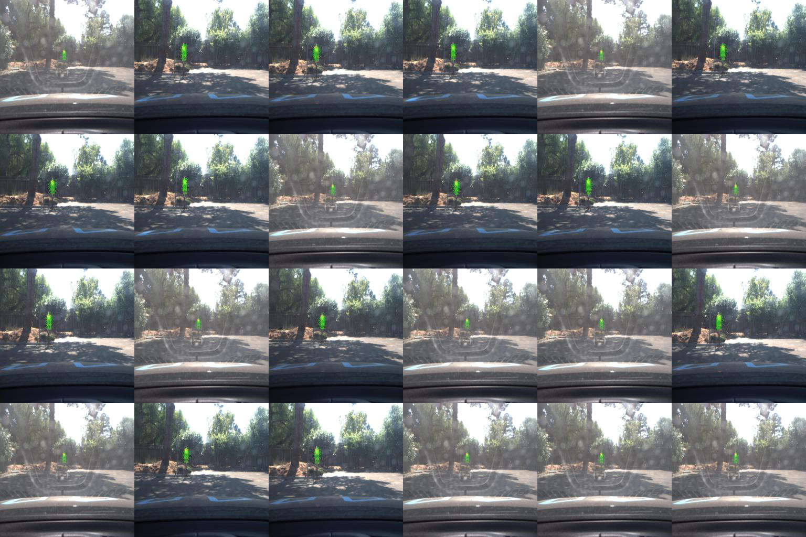

Self-Driving CARLA

The goal of this project is to deploy code on a real self-driving car using ROS and Autoware. The project is tested first on a simulator and then on the real car


The video of the car runing in simulation mode can be found at this link.
[](https://www.youtube.com/watch?v=nc2N41aKXK0 "Capstone Driving Video")

### Native Installation

* Be sure that your workstation is running Ubuntu 16.04 Xenial Xerus or Ubuntu 14.04 Trusty Tahir. [Ubuntu downloads can be found here](https://www.ubuntu.com/download/desktop).
* If using a Virtual Machine to install Ubuntu, use the following configuration as minimum:
  * 2 CPU
  * 2 GB system memory
  * 25 GB of free hard drive space

  The Udacity provided virtual machine has ROS and Dataspeed DBW already installed, so you can skip the next two steps if you are using this.

* Follow these instructions to install ROS
  * [ROS Kinetic](http://wiki.ros.org/kinetic/Installation/Ubuntu) if you have Ubuntu 16.04.
  * [ROS Indigo](http://wiki.ros.org/indigo/Installation/Ubuntu) if you have Ubuntu 14.04.
* [Dataspeed DBW](https://bitbucket.org/DataspeedInc/dbw_mkz_ros)
  * Use this option to install the SDK on a workstation that already has ROS installed: [One Line SDK Install (binary)](https://bitbucket.org/DataspeedInc/dbw_mkz_ros/src/81e63fcc335d7b64139d7482017d6a97b405e250/ROS_SETUP.md?fileviewer=file-view-default)
* Download the [Udacity Simulator](https://github.com/udacity/CarND-Capstone/releases/tag/v1.2).

### Docker Installation
[Install Docker](https://docs.docker.com/engine/installation/)

Build the docker container
```bash
docker build . -t capstone
```

Run the docker file
```bash
docker run -p 127.0.0.1:4567:4567 -v $PWD:/capstone -v /tmp/log:/root/.ros/ --rm -it capstone
```


Usage

1. Clone the project repository
```bash
git clone https://github.com/asterixds/CarND-Capstone.git
```

2. Install python dependencies
```bash
cd CarND-Capstone
pip install -r requirements.txt
```
3. Make and run styx
```bash
cd ros
catkin_make
source devel/setup.sh
roslaunch launch/styx.launch
```

### Real world testing

1. Download [training bag](https://drive.google.com/file/d/0B2_h37bMVw3iYkdJTlRSUlJIamM/view?usp=sharing) that was recorded on the Udacity self-driving car (a bag demonstraing the correct predictions in autonomous mode can be found [here](https://drive.google.com/open?id=0B2_h37bMVw3iT0ZEdlF4N01QbHc))
2. Unzip the file
```bash
unzip traffic_light_bag_files.zip
```
3. Play the bag file
```bash
rosbag play -l traffic_light_bag_files/loop_with_traffic_light.bag
```
4. Launch your project in site mode
```bash
cd CarND-Capstone/ros
roslaunch launch/site.launch
```
5. Confirm that traffic light detection works on real life images


## Implementation Notes
#### Going round the track
The waypoint updater is primed using the waypoints from the waypoints loader. It subscribes to car pose updates and traffic sign detection messages (only red light detections) and publishes future waypoints. The waypoint velocity is set to target speed if no redlight is detected (within the detection horizon) or set to a decreasing velocity profile upto the waypoint matching the redlight waypoint.


#### Traffic Sign Detection
The traffic signdetection mode listens to traffic light loaction and camera image messages and uses the classifier to detect traffic light (in particular red light). Originally an FCN was trained to detect traffic signs based on the real world bag signs. However, this method was dropped due to the large size of the saved model file which was around 1/2 GB. The results of the FCN classier trained to detect red lights is shown below. 


Instead, the final method used (after also trying out a SVM classiefier) was a 2-stage process using a HAAR cascade to detect candidates for classification and then a CNN detector based on the traffic sign classier project. The CNN has been trained on images to be found in the gt folder of the tl_detector node. One can see the dump of the red light detections by setting the DEBUG flag to true in the tl_detector.py

Once detected, the TLDetector node finds the matching stop line and publishes the nearest waypoint to the traffic_waypoint topic. 

The results of the classifcation are shown below:


### TBD:
* Improvements to the TwistController 
* Check if any edge cases need to be handled when looping around
* see if detection improves with projecting camera image to local car coordinates and zooming in.

